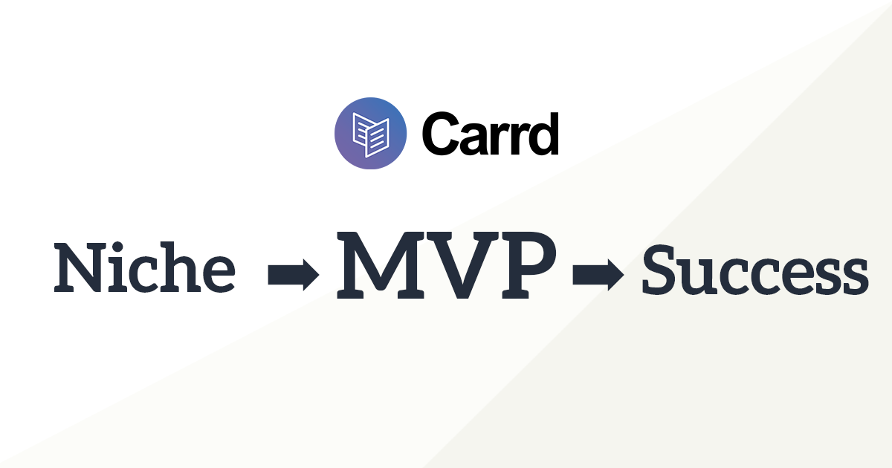
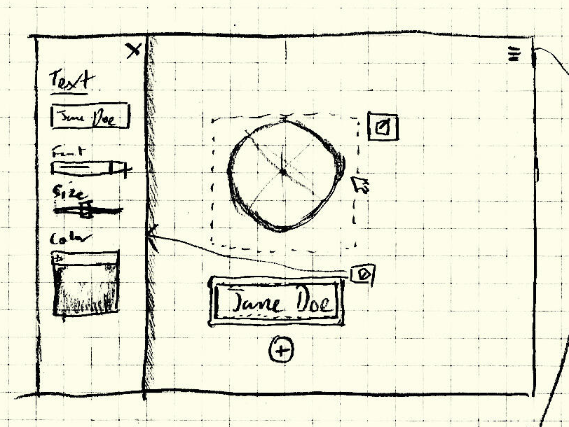
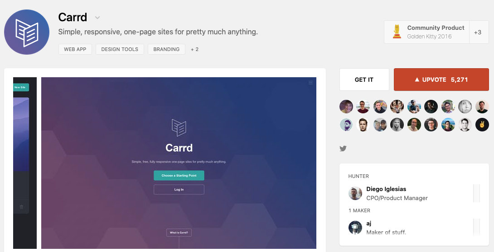

Compared to other industries, software businesses can scale with unparalleled efficiency. Carrd is a 2-person company that has managed to grow to over $1m ARR and over 1.6 million users since launching in 2016. For those unaware, Carrd is a tool that allows people to build one-page sites for pretty much anything.

Carrd competes in a crowded website-builder industry against much larger companies like Automattic (Wordpress.com), Squarespace, and Wix. In a similar fashion to Plausible's success [competing with Google Analytics](https://www.smalltechbusiness.com/how-plausible-finds-success-and-differentiates-from-google-analytics/), Carrd has been able to carve a subset of the market that fits perfectly for a business with an indie foundation. [AJ](https://twitter.com/ajlkn), Carrd's sole founder, then built and launched a great MVP that leveraged the unique strengths of Carrd's niche.

### Finding an Indie-friendly Niche

AJ knew he wanted to build a site-builder, but he also knew he didn't want to directly compete with the full scale of Squarespace. He narrowed his options down to 4 focused use-cases: *portfolio*, *landing page*, *microblog*, or *profile*.

AJ chose to concentrate on *profile* and [in a blog post](https://themakingof.carrd.co/#build) he explained his reasoning:

> **It was simple**. As in, *one-page* simple, with usually just a photo, some text, a few links, and maybe a background image. Which was awesome, because that simplicity could be reflected at *every level* of the site builder — from its UI all the way to its backend. 
> 
> **It had wide appeal.** Unlike the other three niches, this one wasn't limited to a specific audience. In fact, it was open to pretty much anyone wanting a basic presence on the web (= a lot of people).
> 
> **It was popular.** Two of the most popular downloads at HTML5 UP, Aerial and Identity, were one-page profile templates, which I found a bit surprising until I began running into them everywhere and saw how well they worked in practice.

By selecting a primary type of website he would enable users to build, he not only made his product simpler to build, but he also strategically differentiated his product from its alternatives.

### **Strategizing Around Your Niche**

There are a lot of low-code page building products on the market, like Notion, that tout themselves as being feature-rich and filling many use-cases. For small indie teams, more features isn't always practical or even effective. By centering Carrd as a builder for online profiles, AJ was able to sculpt his strategy around a particular customer base. Products like Squarespace aim to be a one-stop shop for building websites, ranging from online stores to portfolio sites. This inevitably makes their onboarding process clunkier as they need to spend time pinpointing what type of customer you are.

For Carrd, AJ knew that users looking to build a simple profile site would prefer a mobile-friendly interface that was not cluttered with irrelevant functionality and noisy features. The onboarding process was optimized to be low-friction. Users could jump right into designing their site before even signing up. And because the "time-to-value" of Carrd's MVP was so efficient, trust with first-time visitors was able to be established very quickly.

### **Knowing Your Launch Strategy**

From the beginning, AJ knew that he was going to launch Carrd on Twitter first, followed by a larger launch on Product Hunt after. This knowledge played a big part in convincing AJ to ensure Carrd had a super simple onboarding process. Traction channels like Twitter and Product Hunt are most effective when you can convince users to stay *before* they bounce off your landing page. This provided even more of a reason for Carrd's low-friction onboarding, by converting more first-time visitors AJ was able to maximize his best marketing channels.

While you can succeed without a predetermined launch strategy, having one early can certainly help you build a more successful MVP by helping you maximize traction and figure out your initial feature set.

### **Balancing Feature Count with Implementation Costs**

Indie hackers constantly preach building and launching an MVP as quickly as possible. This is advice is fine, but it often is presented without guidance on how to define a good MVP. When deciding Carrd's initial state, AJ did a fantastic job finding a balance between functionality and cost.

From AJ's write-up on [his original plan for Carrd](https://themakingof.carrd.co/#plan):

> **Make every site a simple "stack" of elements**. While this effectively limited each site to a single basic layout, profile sites usually followed some variant of this pattern anyway. Plus, its sheer simplicity meant practically *everything* (from handling responsiveness to the site builder UI itself) would be *significantly* easier to pull off.
> 
> **Let users choose the stack's *position* on the page as well as the alignment of its elements**. Simple customizations, but ones that would add some much needed variety to my otherwise one-note stack pattern.
> 
> **Give users the tools to heavily customize *everything* else**. That is, go *beyond* the stuff you'd usually expect. For example, in addition to choosing a text element's font, size, and color, allow users to tweak more *advanced* stuff like casing, line height, and letter spacing. Same deal with the page background: allow the use of not only solid colors and images, but also custom gradients and advanced features like gradient overlays and granular image positioning/sizing.

Simplifying the layout of all of Carrd's templates to be a stack of elements greatly reduced the complexity of Carrd's editor. But that led to a new problem - would this make the sites look too similar and bland to stand out? To counteract this, AJ made sure to make everything else customizable - fonts, colors, backgrounds, etc. Adding this level of customization is relatively cheap, but the impact for users is massive - sites still ended up feeling very distinct.

The takeaway here is that to build a good MVP, you need to wear both a product hat and an engineering hat. To balance the needs of the users with the costs of implementing certain features, often you will be able to find a path that compromises both well. This concept is not unique to indie tech, many Silicon Valley software companies [prioritize hiring people who can do this](https://qz.com/766658/the-highest-paid-workers-in-silicon-valley-are-not-software-engineers/).

### **Keeping Costs Low, Maximizing Your Strengths**

Before starting Carrd, AJ already had a ton of experience creating website templates. One of the keys to Carrd's success was the quality and clean design of each of Carrd's templates. Building a product that hinges around one of your areas of expertise is a fantastic strategy as it reduces the risk of domain knowledge gaps and the need to pay an expert. I see a lot of indie hackers using this strategy, often this involves someone leaving an industry, learning to code, and building a product to solve a need from their previous job.

Another way that Carrd has been able to scale with just a 2-person team is that Carrd is an extremely low-touch product in terms of customer support. A combination of a high-quality product and a fairly simple end-product allows Carrd to avoid exorbitant support tickets, despite having over a million users. Your product may not be able to avoid spending resources to service customers, but it will always be important to keep your operating costs low as much as possible. The more efficiently your company is in terms of profit, the higher chance you will be able to carve out a successful niche.

### **Steps to Success - Putting it all together:**

1. Find your niche, one that leverages some of your existing strengths.
2. Figure out and leverage how your niche allows you to differentiate from your competitors
3. Determine your best acquisition channels before you complete your product’s design
4. Strike a good balance between (expected) customer needs and keeping your product simple - you can always expand more after you get more customer feedback.