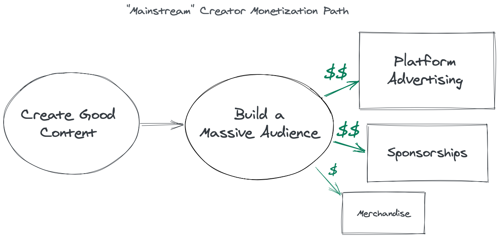
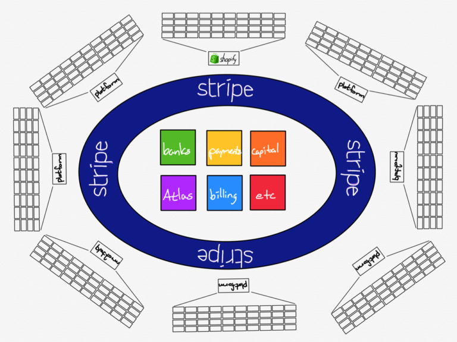
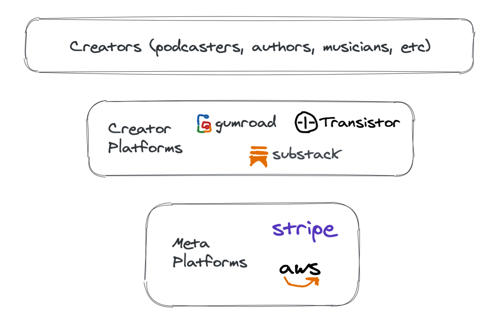

Due to the ongoing pandemic, [over a third of the American workforce](https://www.npr.org/2020/09/16/912744566/jobs-in-the-pandemic-more-are-freelance-and-may-stay-that-way-forever) is now freelancing in some capacity, this represents a significant shift where individuals are choosing to work for themselves rather than for companies. Similar to freelancing, many are choosing to generate income by creating content online.

Prior to 2020, content creators with engaged followings were already on an upward trajectory. Recently, a media and research analytics agency [interviewed over 4,500 micro-influencers](https://www.digitalcommerce360.com/2020/09/16/covid-19-is-changing-how-why-and-how-much-were-using-social-media) and found that both content creation and consumption increased in 2020, with 43% of influencers reporting they were posting more during the pandemic.

This growth in the Creator Economy, however, extends far beyond just the big players (YouTube, Twitch, TikTok, etc.). There are countless creators that focus on niche audiences and are able to create profitable digital content like eBooks, podcasts, or music.

**The businesses that enable these creators** have seen a ton of growth and success themselves:

- Gumroad's creator revenue [grew 94% in 2020 to $142 million](https://gumroad.com/gumroad/p/last-year-in-the-creator-economy)
- Substack's total paid subscriber count [grew over 250% during the pandemic](https://twitter.com/TurnerNovak/status/1309138380916170765?s=20)
- OnlyFans earned [over $300 million in *profits* in 2020](https://www.theinformation.com/articles/onlyfans-is-not-only-popular-but-hugely-profitable)
- Transistor.fm (podcast hosting) ARR [grew over 120% in 2020](https://justinjackson.ca/2020-review)

## Defining the 'Creator Economy'

[Neoreach](https://neoreach.com/creator-economy/#What_is_the_Creator_Economy), a leading influencer marketing SaaS platform, has an apt definition for the 'Creator Economy':

> The “Creator Economy” refers to the class of business that focuses on independent content creators, curators, and community builders. This can include influencers, bloggers, videographers, and the various software tools and services that assist them in their work.

Most articles on the Creator Economy focus on social media, YouTube, and streamers. Creators on those platforms follow a well documented, prescribed monetization strategy:

For creators focusing on niche audiences the path to monetization is much more straightforward:

1. Create digital content
2. Get paid for content

Podcasters, newsletter publishers, online-course creators, self-published authors are all part of the new wave of niche content creators. Establishing early relationships with these emerging brands can pay dividends down the road as their popularity and reach grows.

## Building for Creators

Most creators earn revenue directly from creating content or indirectly via advertising. This makes them an attractive group to build products for because, similar selling to businesses, solving their problems has a direct impact on the bottom line.

Consumer apps, like Evernote or Reddit, typically solve nebulous problems like boredom or procrastination. Not only is there usually more competition, but it can also be difficult to become profitable without a massive user base as the average user will be unwilling to pay.

Creator focused products, meanwhile, often avoid the monetization dilemma that consumer products struggle with, while still being able to target individuals as their primary customer. This is a huge advantage over selling to businesses, because you only need to convince one person to make a sale - avoiding a costly sales funnel.

Building for mainstream creators requires a large, scalable platform that can handle high traffic and hefty costs as it can be considerably expensive to host large volumes of video or audio files. Fortunately, as evidenced by the businesses listed earlier - you don't need a massive team to build for creators.

**The three main ways** for smaller teams to build for creators:

1. **Narrow down the creators your product targets.** Figure out how to improve workflows for one type of creator - specific targeting will make your product stand out to that group of creators.
2. **Limit the audience your product serves.** This will help you reduce the functionality needed to ship an MVP of your product.
3. **Reduce the number of problems your product tries to solve.** Not every business needs to start out as a platform, focus on solving one problem well and then expand from there.

## Gumroad - Building for a Subset of Creators

In 2011, [Sahil Lavingia](https://twitter.com/shl) quit his job at Pinterest to build Gumroad, an online platform that facilitates the sale of products by creators directly to consumers. In 2019, Gumroad recorded $5m in revenue (up 46% YoY) as well as $1.7m gross profit (up 68% YoY).

Gumroad's success has been an inspiring example of a modern small tech business that boasts an [innovative company culture](https://sahillavingia.com/work) (no meetings, deadlines, or full-time employees) while also being hugely profitable.

Though they now support over 46,000 creators on their platform, Gumroad's journey has been anything but smooth-sailing (I highly recommend reading [Sahil's recounting of Gumroad's tumultuous path to success](https://sahillavingia.com/reflecting)).

Gumroad's earliest customers were indie musicians selling tracks online. Since then, they have expanded to target self-published authors, indie filmmakers, and online course creators. They succeeded by initially marketing to a subset of creators while building features to satisfy their specific needs. As their product's range of features expanded, they were able gradually expand to support more types of creators.

For small teams, it makes sense to build for a niche of creators first. This allows you to differentiate your product from the less specialized existing alternatives while also testing and iterating your product sooner rather than later.

## Substack - Focusing on a Type of Audience

Substack launched in 2017 and is now nearing 10,000 subscribers and $1M in revenue. The email newsletter platform has has aimed to shake-up the existing media landscape. From [Substack's launch blog post](https://blog.substack.com/p/a-better-future-for-news):

> At the core of Substack’s mission is the belief that, by democratizing the tools that they need to create independent businesses, we can help writers succeed in an era in which the overall market for news grows dramatically. When it has reached maturity, the subscription-based news industry could well be much larger than the newspaper business ever was, much like the ride-hailing industry in San Francisco is bigger than the taxi industry was before Lyft and Uber. Democratizing this subscription-based future will enable more writers to earn more money by writing about what truly matters. It puts the media’s destiny into the right hands.

On the surface, Substack is a platform for independent journalists and bloggers looking to make a profitable splash in the news industry. This sounds like an overwhelmingly large market to build a product for, but Substack has been able to limit the scope of their product by serving a single type of audience - people who like reading newsletters.

Having used Substack myself, I can attest that Substack's product focus is a huge part of its success.

- For authors, everything is streamlined for writing posts and publishing them
- For readers, everything is streamlined towards reading and subscribing to publications

By narrowing down the audience (consumers of the platform's content), Substack was able to efficiently build a crisp and focused platform for its creators. 

## Transistor - Solving a Specific Problem

Transistor.fm was launched in 2018 by [Jon Buda](https://twitter.com/jonbuda) and [Justin Jackson](https://twitter.com/mijustin) to solve a basic problem for podcasters - podcast hosting.

This is the most focused of all the examples we have covered. Not only does Transistor support just one type of creator, they also focus on a single problem.

There are a few reasons why podcast hosting was a great problem to solve:

1. **Proven market** - Hosting is a necessity for podcasts, and podcasters already pay for it without convincing
2. **Room for innovation** - Podcasting has been around [since the early 2000's](https://en.wikipedia.org/wiki/History_of_podcasting), many podcasts were hosted on [platforms not built for podcasting specifically](https://journals.sagepub.com/doi/full/10.1177/2056305119880002)
3. **Fast-growing industry** - As of 2020, [over half of all Americans](https://www.statista.com/chart/10713/podcast-listeners-in-the-united-states/) have listened to podcasts. More importantly for Transistor, the number of active podcasts has [grown from 500,000 to 850,000 in less than 2 years](https://www.oberlo.com/blog/podcast-statistics).

That last point is key - building for an organically growing market allows for teams to focus more on building a differentiated product. The Creator Economy is growing fast, so teams just need find a good problem to focus on solving.

## Stripe: Platform for Creator Platforms

Gumroad, Transistor, Substack all are built with Stripe as their underlying payment processor. Ben Thompson wrote about the idea of Stripe as a platform of platforms in his [Stratechery article, *Stripe: Platform of Platforms*](https://stratechery.com/2020/stripe-platform-of-platforms/):

*(Below: Thompson's illustration of Stripe as a platform of platforms)*

While Thompson's article uses Shopify as an example platform that uses Stripe, it's clear that Stripe's reach is well beyond just eCommerce applications.

Amazon's AWS is the next closest "platform for Creator platforms". Similar to the role Transistor plays as a hosting platform for podcasts, AWS is the hosting platform for many Creator platforms.

Stripe and AWS are both platforms that serve many more use cases outside of Creator platforms, but we have yet to see a meta-platform focused on serving mainly Creator platforms. As the Creator Economy continues to grow (and thus the platforms that support it), naturally the need for more meta-platforms will emerge.

There are two inevitable problems that will arise for Creator platforms:

1. Efficient storage and retrieval of large amounts of content
2. Easier consumption of content from different platforms

Most organizations will choose to solve the first problem with in-house engineering, but as content begins to pile-up, scalability concerns could prove to be costly. This is where a platform focused on upload and distribution of specific types of content could shine.

The second problem is starting to be solved by consumer products like [Mailbrew](https://mailbrew.com), that make disparate content easier to consume in one place. I could easily see more apps arising that aim to integrate with many Creator platforms, to give consumers a more centralized place to consume their content. Podcasts currently have this solved with RSS feeds + podcast playing apps, but [Spotify is looking to change that](https://www.theverge.com/21265005/spotify-joe-rogan-experience-podcast-deal-apple-gimlet-media-ringer).

### Further Reading:

- [*"The Create Economy Needs a Middle Class"*](https://hbr.org/2020/12/the-creator-economy-needs-a-middle-class) by Li Jin, *December 17, 2020*
- [*"Mapping the Creator Economy"*](https://hugo.pm/mapping-the-creator-economy/) by Hugo Amsellem, *December 3, 2020*
- [*"Lessons about the Creator Economy from Twitch and Substack"*](https://peteryang.substack.com/p/lessons-about-creator-economy) by Peter Yang, *November 18, 2020*