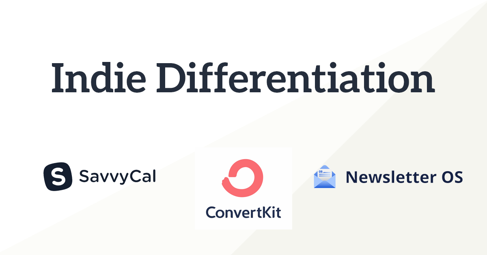
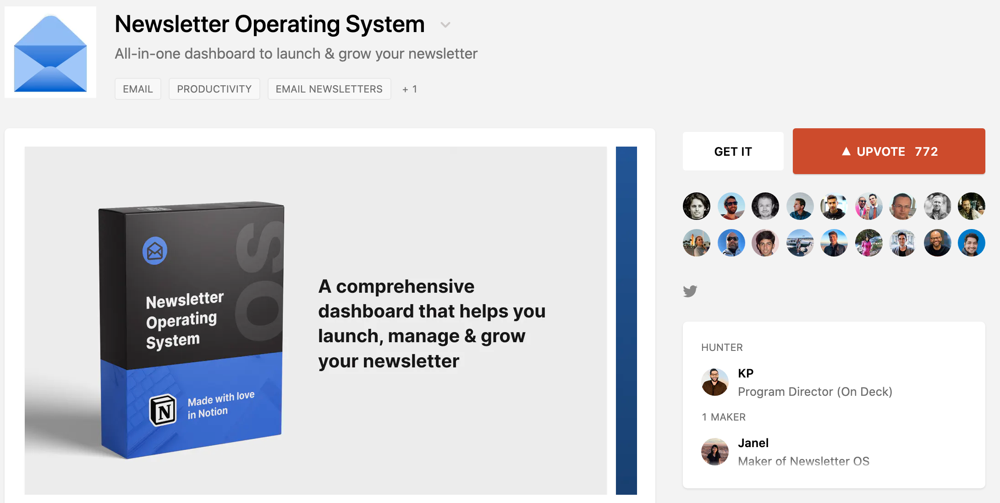

For most indie tech businesses, tackling an existing market is easier than creating a new one. Instead of trying to convince businesses to grasp (and use) a completely new product category, many indie tech founders have instead chosen to build products that improve upon existing options in the market.

*But wait, what did you mean by "improve"? That was vague.*

Great question - the truth is that what gets deemed an "improvement" is highly subjective. For example, if your focus is on privacy, then [Plausible Analytics is easily an improvement over Google Analytics](https://www.smalltechbusiness.com/how-plausible-finds-success-and-differentiates-from-google-analytics/). But for a large marketing team, Plausible's smaller feature set is hardly an improvement. It ultimately depends on what the customer's main focuses are. If you can differentiate your product in an area that your target customers care most about, you will be able to convert.

# ConvertKit -- Differentiating from a Massive Competitor

Mailchimp is by far the leader in email marketing. In their 2019 annual report, they [claimed to have over 60%](https://martech.org/mailchimp-claims-over-60-share-of-email-industry-in-latest-report-2/) of the market share and **over 12 million customers**. Despite those staggering numbers, this scenario smells of a ripe opportunity for indie founders; those 12 million paying customers are unlikely to all have the same focus.

After building an audience and launching 2 eBooks, Nathan Barry decided to challenge Mailchimp by launching an email marketing platform focused on the needs of content creators like himself. In the early stages of his project's development, he focused on building a product that helped with the most important goal of a content creator building an email list: **growth**.

Nathan [wrote about this strategy in a 2013 blog post](https://nathanbarry.com/best-marketing-method/):

> With ConvertKit it is easy to set up a new landing page, upload a PDF or another file to offer as an incentive, then let the subscriber opt in to an email course.
> 
> Sure, you can hack this process together using two or three off-the-shelf landing page and email tools, but it’s a pain. ConvertKit is designed to make this process very easy, so you can focus on creating content and products that really deliver value to your visitors.

ConvertKit has been able to generate [over $2.3m MRR off of just 36 thousand customers](https://convertkit.baremetrics.com/), which is **less than 0.3%** of Mailchimp's total customer count. ConvertKit is a prime example of how much upside exists if you can successfully differentiate your product in a massive industry full of competitors.

# Savvy Cal -- Reframing the Scheduling Problem

Calendly is a popular calendar scheduling app that helps you set up meetings efficiently. The basic flow is that Calendly users will send a Calendly invite which prompts the recipient to select from a list of available times. Calendly's product focus is to make it as easy as possible for their users to manage their calendars and schedule meetings, and it largely succeeds.

There is a wrinkle though, by focusing too much on just the paying customer of Calendly, a major blindspot emerged: the person receiving the calendar link. Not everyone agrees, but there is a notable number of people that feel sending a calendar link is impersonal and rude. Savvy Cal's founder, Derrick Reimer, noticed this and saw an opportunity to provide a better solution to the problem. Derrick described this on the [Indie Hacker podcast with Courtland Allen](https://share.transistor.fm/s/ddad295d):

> [38:01] I used [Calendly] to schedule customer interviews for all products I’ve done in the past… The thing that got me really intrigued by it was observing the weird power dynamic issue that arises around using scheduling links. There are some pockets of the industry where people refuse to use calendar because it is just too laden with landmines, like you might end up offending somebody and so they just always fall back to the old-fashioned way of scheduling things.
> 
> It was a curious thing to me that like there is this class of tools that save people time and there’s all this resistance to using them.
> 
> I wasn’t seeing a lot of innovation happening on the product front around trying to make this better.

Derrick Reimer saw a way to reframe the solution with Savvy Cal. Instead of maximizing convenience for only the paying customer, Savvy Cal's focus was on the relationship between the two people scheduling the meeting. That reframing unlocked the doors to customers that Calendly did not serve well.

With Savvy Cal, Derrick tackled a common problem with a solution from a different angle, which has helped lead to his success. With [Newsletter OS](https://newsletteros.com/), Janel approached an **entire product category** with a unique solution.

# Newsletter OS -- A New Type of Info Product

Newsletter OS was [launched in November 2020](https://www.indiehackers.com/post/1-most-commented-on-product-of-the-week-on-product-hunt-7e753b13f7) as "a comprehensive dashboard that helps you launch, manage, and grow your newsletter."

Most info products are either an eBook or an online course. And plenty of people have made a lot of money creating and selling them. But just because those formats are by far the most common, doesn't mean that they are the most effective.

Janel wanted to package everything that would be most useful to someone growing a newsletter - both knowledge (database of resources and tools) and structured process (email templates & revenue trackers). A book would have been too hands-off, while a full-blown course would be too much overhead for people who likely run their newsletter as a side project. The format Janel settled on was perfect, it was extremely practical and its value was easy to market and explain.

Let's face it, things move quickly. 2020 was a clear example of how rapidly entire industries can undergo drastic change. As society's preferences change, or as new tools unlock further capabilities, founders can take advantage of these opportunities by creating differentiated solutions like Savvy Cal and Newsletter OS.

# Differentiate by Building for Your Customer

The most important path to differentiation is **catering to your customers**. Twilio's founder and CEO, Jeff Lawson, described [in a podcast interview](https://a16z.com/2021/01/12/rise-of-developers-creative-class-company-innovation-ask-a-developer-book/) why it is so important to build for your customers:

> Think about your bank. Twenty years ago, your bank was a storefront that you walked into; it was clean, the teller was friendly, and they gave your kid a lollipop — okay, I like my bank. And now your bank, of course, is a mobile app. Suddenly, the interface you put in front of that customer is the perception of your product and of your value as a company. You like your bank if the mobile app is fast; if it is bug free; and if it has a lot of features and functionality to make your life a little bit easier.
> 
> Back in the days when it was back office, it would be common for IT departments to say, “Okay, should we build versus buy?” And a vendor would inevitably come in and say, “Don’t reinvent the wheel”, and you just bought something off the shelf. But now in a world where the software you use is your source of competitive differentiation, *the act of building is the act of listening to your customer* — and so now, the question has gone from build versus buy to build versus die!

Earlier in that same interview, Jeff described how most software products today get a bulk of their functionality by building on top of existing open-source libraries, APIs, and other abstractions. Therefore, it is easy for other companies to build competitive products by building off of those same blocks. Jeff argues that a company's competitive edge comes from listening to your customers and building for them - because if you don't someone else will.

Catering to your customers is something that smaller businesses can do better than most big tech companies, primarily because you can provide customers with "white glove" treatment. For example, a B2B SaaS company, like [Hyperping](https://hyperping.baremetrics.com/), with less than 1,000 customers can listen to each customer and can adjust its product roadmap accordingly to cement a fantastic, loyal relationship moving forward.

# Paths to Differentiation - Wrap-up:

- **Don't be afraid to go after large, crowded markets** like email marketing - you only need to convince a tiny portion of it to be successful
- For some existing problems, take a step back and **try to reframe a solution** that resonates with customers better
- As new tools and platforms arise, take advantage of the opportunity to **create a new type of product**
- It's never too late to talk to your customers and stand out by **building for their exact needs**