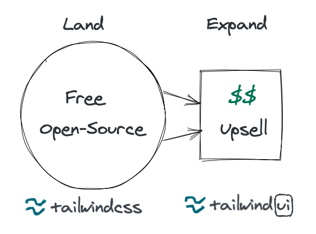

[Tailwind CSS](https://tailwindcss.com/) is an open-source CSS framework that was released in November 2017 by Adam Wathan ([@adamwathan](https://twitter.com/adamwathan)) and Steve Schoger ([@steveschoger](https://twitter.com/steveschoger)). Then, 2 years later, they launched Tailwind UI which generated over $2m in revenue. If you're looking for a master class on how to monetize an open-source project - look no further than Tailwind.

### A New Way to Style Your Web

It is nearly impossible to discuss CSS frameworks without mentioning Bootstrap, a UI framework which made it considerably easier for developers to build a visually appealing website. Bootstrap was released in 2011 by Twitter and ranks in the [top 10 of most "starred" repositories in Github](https://github.com/search?o=desc&q=stars%3A>1&s=stars&type=Repositories).

Tailwind and Bootstrap, however, can't be directly compared. Tailwind, after all, is a CSS utility library while Bootstrap is more of a complete UI kit. This difference, thought, is key to Tailwind's success.

Bootstrap has a gentle learning curve, making it easier for a beginner to pick up and use. The key drawback is that it achieves that simplicity at the cost of having Bootstrap-specific concepts and components that lack flexibility.

Tailwind, on the other hand, has aimed to change the way developers think about styling their web apps. Adam describes this shift in his post, [*CSS Utility Classes and "Separation of Concerns"*](https://adamwathan.me/css-utility-classes-and-separation-of-concerns/):

> Over the last several years, the way I write CSS has transitioned from a very "semantic" approach to something much more like what is often called "functional CSS."

He continues to describe Tailwind's approach to CSS as "utility-first":

> The reason I call the approach I take to CSS utility-first is because I try to build everything I can out of utilities, and only extract repeating patterns as they emerge.

This utility-first approach pays off in the long-run because the patterns that should be shared are identified when they are needed and are made with an explicit focus on being reusable. The semantic nature in which CSS is used in Bootstrap projects leads to CSS classes that are only reusable in very specific situations and are difficult to extend.

To further exacerbate Bootstrap's loosening footing, the introduction of native CSS features like Flexbox and Grid has made Bootstrap's once-innovative grid layout system feel limiting. Ironically, Bootstrap's popularity was a huge inspiration for both Flexbox and Grid.

Tailwind is already being used in [over 100k Github repositories](https://github.com/tailwindlabs/tailwindcss/network/dependents), an impressive number for a fairly new framework without any institutional backing. This dependent repository count, while not perfect, is one of the best metrics for showing Tailwind's growing popularity.

### Serendipidous Beginnings

Today, Tailwind is an undeniable success yet its journey has been anything but straightforward. In an [insightful post by Tailwind's founder Adam Wathan](https://adamwathan.me/tailwindcss-from-side-project-byproduct-to-multi-mullion-dollar-business/), he describes how back-to-back failed projects eventually led to a decision to build Tailwind CSS.

Adam and Steve's consistent motivation to build, learn, and ship products was key to their eventual success in launching a successful project. The second is that building in public and building an audience was a huge boon to their early growth and subsequent success.

Building in public is by no means a prerequisite for success, but there are certain situations where it can be too advantageous to pass up:

- A developer building an open-source tool for other developers
- An author writing a book about self-publishing a book (e.g. Nathan Barry's [Authority](https://nathanbarry.com/authority/))
- An online course about building an audience online (e.g. Daniel Vassallo's [Everyone Can Build a Twitter Audience](https://gumroad.com/l/twitter-audience))

Worth mentioning as well, is the simultaneous success of Adam and Steve's book, [Refactoring UI](https://refactoringui.com/book/). This project leveraged more of Steve's expertise as a visual designer, but the resulting audience for that book had a ton of overlapping interest with Tailwind.

### Monetizing Open-Source

Not only can a successful open-source monetization strategy lead to a successful business, but in more modest cases it can at least make project sustainable. It's not uncommon for [open-source maintainers to burnout](https://www.jeffgeerling.com/blog/2020/saying-no-burnout-open-source-maintainer), as once the novelty of popularity wears off maintainers can be left with a pile of growing unpaid work.

There are many successful examples of monetized open-source projects:

- [MongoDB](https://www.mongodb.com/pricing) and [Redis](https://redislabs.com/redis-enterprise-cloud/pricing/) both have fully managed services
- [Vue.js is monetized through donations and corporate sponsorships](https://www.indiehackers.com/podcast/078-evan-you-of-vue)
- [jOOQ](https://www.jooq.org/download/) and [ag-grid](https://www.ag-grid.com/license-pricing.php) both opt for selling licenses for enterprise features and support

With the recent launch of [Tailwind UI](https://tailwindui.com/components), Tailwind's strategy is one of the first I have seen that involves building a separate (but related) product. If you weren't aware, Tailwind UI is a component kit built with Tailwind CSS. 

Their strategy follows the assumption that many users turn to Tailwind CSS to develop beautiful, elegant UIs for their web apps, and that a portion of those users would be willing to save themselves time and effort to purchase ready-made components that fit their common use cases.

The synergy between Tailwind CSS and Tailwind UI resembles a [land and expand](https://saasx.com/2018/09/13/how-to-execute-a-saas-land-and-expand-strategy/) strategy. Their open-source framework is great at reaching a massive audience of developers, which becomes a funnel to land customers for their paid product. The quality of Tailwind CSS builds trusts and makes the upsell of Tailwind UI easier.

The fact that the open-source Tailwind CSS remains separate and fully intact is significant. The problem with the aforementioned enterprise license model is that the best, most useful features are hidden behind a paywall. These artificial walls cause friction to both the customer and the team developing the product.

Ultimately, I think Tailwind UI's one-time $250 price tag is a great starting point for a new product, but it will make less sense after a couple years of continued development. It reminds me of the "lifetime access" licenses that new SaaS products that some companies like [Tiiny Host](https://www.indiehackers.com/product/tiiny-host) have tried.

As more components and features are added to Tailwind UI, I think a pricing model similar to [JetBrain's subscription + perpetual fallback license model](https://sales.jetbrains.com/hc/en-gb/articles/206544679-What-is-our-licensing-model-) would end up being the most effective. It maintains the same perpetual ownership as the current model, except that there is a recurring annual fee to get access to the latest updates. This would allow Tailwind to get fairly compensated for the additional development and support of their product, while still maintaining the customer-friendly lifetime access.