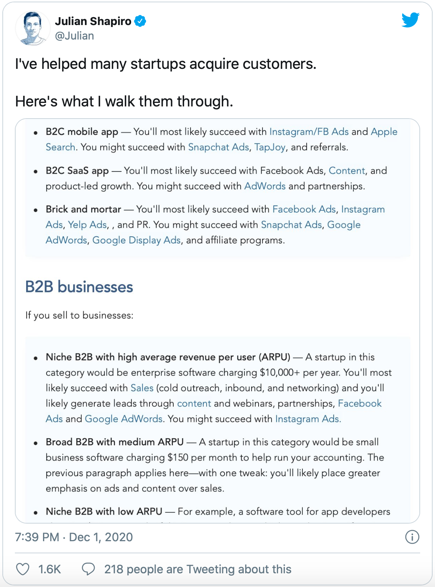

### 1) **[6 things I wish I knew before I bootstrapped my first SaaS startup](https://thenextweb.com/growth-quarters/2020/11/24/6-things-i-wish-i-knew-before-i-bootstrapped-my-first-saas-startup/)**

##### by **[Pierre de Wulf](https://twitter.com/PierreDeWulf)** - Blog Post **📰 (7 min)**

I’ve often preached how valuable it is to learn from other’s mistakes. Pierre provides some great learnings from his own failed startup and outlines how he has adjusted with his current successful business, [ScrapingBee](https://www.scrapingbee.com/).

> “When bootstrapping, time is both your friend and your enemy. It is your friend because you are owning your time and you can do whatever you want with it. It is also your enemy because this sense of ownership will often make you focus on futile things, and next thing you know, it’s been one year and you haven’t shipped a damn thing.”

### 2) **[Rewards and Perils of Being Your Own Customer](https://share.transistor.fm/s/f6a98264)**

##### by **[Arvid Kahl](https://twitter.com/arvidkahl)** via **[The Bootstrapped Founder Podcast](https://thebootstrappedfounder.com/podcast/)** Podcast 🎧 (19 min)

Arvid is back with some more thoughtful analysis from something he has a ton of experience with, being his own customer. This is a strategy I tend to do myself, so I found his insights extremely interesting.

### 3) **[Tech Stack of a One-Man SaaS](https://panelbear.com/blog/tech-stack)**

##### by **[Anthony Simon](https://twitter.com/anthonynsimon)** - Blog Post 📰 (8 min)

Anthony covers all of the tools and technologies he uses as part of his analytics SaaS business, [Panelbear](https://panelbear.com/#features). I always find it interesting to learn about other’s tech stacks and see if any of their tools apply for my projects.

> “A couple of months ago I started working on yet another private analytics service, a project which has gone through numerous iterations, and I feel lucky that 400+ websites have already integrated with it, even though it's still in the early stages.  “

### 4) **[Why indie hackers should be podcasting [Indie Bites Interview]](https://indiebites.co/mark)**

##### by **[James McKinven](https://twitter.com/jmckinven)** via **[Indie Bites Podcast](https://indiebites.co/)**Podcast 🎧 (15 min)

The sheer volume and popularity of podcasts has been growing rapidly for some time now. I found this interview very interesting because the guest, [Mark Asquith](https://twitter.com/MrAsquith), is certainly an expert with his podcast hosting business, [Captivate.fm](https://www.captivate.fm/).

### 5) **[Self-Hosting Still Pays](https://www.servethehome.com/falling-from-the-sky-2020-self-hosting-still-pays/)**

##### by **[Patrick Kennedy](https://twitter.com/servethehome)** - Blog Post 📰 (4 min)

This piece gives some insightful data comparing the costs of running a high-traffic website via co-located servers (self-hosted) vs AWS reserved instances. Of course this is not a one-size fits all statement, but for Patrick’s use-case he has calculated over 40% savings by opting for self-hosting.

 d

## **Small Tech Spotlight: *Exploding Topics***

🔗 Link: [https://explodingtopics.com/](https://explodingtopics.com/)

👤 Founder: [Brian Dean](https://twitter.com/backlinko), [Josh Howarth](https://twitter.com/joshahowarth), and [Kyle Byers](https://twitter.com/Kyle_Byers)

💰 Business Model: Free newsletter that leads to subscription for pro insights.

📦 Product: “We surface rapidly growing topics before they take off."

**Exploding Topics** was first started as Trennd by Josh. After a successful launch that reached #1 on HN, he struggled to monetize despite having solid usage and growth. Not long after, Trennd got acquired by Brian, founder of [Backlinko.com](https://backlinko.com/). That subsequently lead to the rebranding to **Exploding Topic**s as well as some prudent changes like hiring professional bloggers to improve the newsletter. Josh documented this journey with [an excellent post that I recommend reading](https://marker.medium.com/how-my-show-hn-project-got-acquired-after-6-months-954f81ca6a18) (📰 17 min).

I wanted to spotlight **Exploding Topics** because it is able to coexist with large SEO tools like [Ahrefs](https://ahrefs.com/) by carving out a focused niche that doesn’t try to do too much. The free newsletter is so simple to grok, while also providing clear value - helping readers learn about hot trends. The premium product is just as simple - helping professionals get even more valuable, earlier insights on hot trends.

With a powerful tool like Ahrefs, it is very hard to imagine building a competitor. With a simpler, more focused product like **Exploding Topics**, you can target many of the same customers, but in a way that is easy to understand and less daunting to build.

## **In the News:**

- 💰  [Salesforce is buying Slack for $27.7B](https://techcrunch.com/2020/12/01/salesforce-buys-slack/)
- 📦  AWS [announced EC2 Mac instances running MacOS on Mac Minis](https://aws.amazon.com/about-aws/whats-new/2020/11/announcing-amazon-ec2-mac-instances-for-macos/)
- 💉  US Department of Health detailed their [Operation Warp Speed](https://www.hhs.gov/coronavirus/explaining-operation-warp-speed/index.html) (OWS) goal to [vaccinate 100 million people by the end of February](https://www.businessinsider.com/moncef-slaoui-100-million-americans-vaccinated-by-march-2021-2020-12)
- 📱  Twitter [rolled out their version of “Stories”](https://techcrunch.com/2020/11/17/twitter-rolls-out-stories-aka-fleets-to-all-users-will-also-test-a-clubhouse-rival/) with their new “Fleets” feature

## **Super Helpful Tweet of the Week:**

