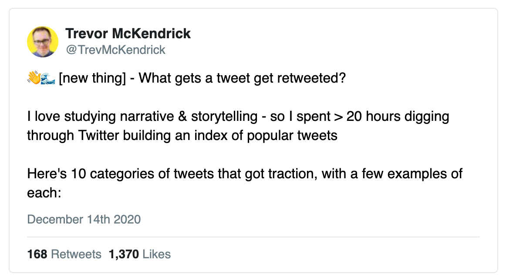

### **1) [Selling a Tiny Project](https://tinyprojects.dev/posts/selling_a_tiny_project)**

### by [Ben Stokes](https://twitter.com/tinyprojectsdev) - Blog Post **📰 (4 min)**

Ben has been working on a series of “Tiny Projects”, his 6 month recap was featured in [a previous issue](https://smalltechbusiness.substack.com/p/small-tech-business-12-common-bootstrapper). In this post he recaps his experience selling one of his projects, [One Item Store](https://tinyprojects.dev/projects/one_item_store). It may not be a life changing amount of money, but it is an inspiring story of how accessible building something profitable online can be.

> The process of selling a website had always been a mystery to me. Therefore, in this post I'll tell you what it was like to sell a tiny project, and how I think anyone can.

### **2) [The State of Sound 2020](https://www.bvp.com/atlas/the-state-of-sound-in-2020-and-beyond)**

### by [Gaby Goldberg](https://twitter.com/gaby_goldberg) and [Talia Goldberg](https://twitter.com/TaliaGold) - Article **📰 (5 min)**

Software innovation over the past decade has largely been focused around internet, mobile, and video. Audio as a medium has existed for sometime, but it is currently in the midst of a second wave of innovation with the rise of podcasts, smart assistants, and the ubiquity of speakers. A great read about the future of this industry.

> Audio, in many forms, has been a well-established medium since the dawning of the telephone and radio, but it’s also the most disparate to study at scale. Now, we believe we’ve reached a point where advancements in software can help us separate the signal from noise.

### **3) [More challenging projects every programmer should try](https://web.eecs.utk.edu/~azh/blog/morechallengingprojects.html)**

### by [Austin Henley](https://twitter.com/austinzhenley) - Blog Post **📰 (3 min)**

Not everything you build needs to be strictly for business. There’s nothing wrong with building something exciting, it can often lead to a new perspective or a new opportunity that might not have surfaced otherwise. Exploration is a catalyst of innovation. Austin provides a great list of challenging programming projects to tackle, all of which have the potential to mature into marketable products.

### **4) [Open Source Auth product - Super Tokens](https://supertokens.io/)**

### by [Super Tokens](https://twitter.com/supertokensio) - Product **📦**

Auth is something that I don’t personally enjoy implementing myself in my projects and it is something that I’ve not been very impressed with the current solutions. Super Tokens just launched recently and looks really promising. It is free and open source as a self-hosted option and they also offer a hosted solution with a very generous free tier (5k MAU).

Super Tokens’ open source auth solution

### **5) [Building Your Color Palette](https://refactoringui.com/previews/building-your-color-palette/)**

### by [Refactoring UI](https://twitter.com/refactoringui) - Article **📰 (6 min)**

Picking a good color scheme may seem like a simple task, but picking a color scheme that looks polished and professional is not straightforward. This article has fantastic visuals to guide you on how to come up with a cohesive color scheme for your product.

Refactoring UI’s guide to color palettes

## Small Tech Spotlight: *Plausible*

🔗 Link: [https://plausible.io](https://plausible.io/)

👤 Founder: [Uku Taht](https://twitter.com/ukutaht) and [Marko Saric](https://twitter.com/markosaric)

💰 Revenue: $8K MRR

📦 Product: “Plausible is a lightweight and open-source website analytics tool."

### Competing with a behemoth - A look into how ***Plausible*** finds success and differentiates from Google

**Plausible** was [launched in April 2019](https://plausible.io/blog/launching-plausible) and has grown to over $8K MRR in less than 2 years. Not only is Plausible an inspiring example of a successful small tech business, but it is also one that helps other growing indie hackers.

Plausible’s landing page prominently states “Simple and privacy-friendly alternative to Google Analytics.**”** Google is one of the largest and most powerful software companies in the world. Google Analytics is by far the most widely used tool for web analytics and it comes at no monetary cost.

So how does Plausible, a company run by 2 people (Uku and Marko), manage to find success against such an intimidating competitor?

They market 4 main selling points:

1. Simplified analytics
2. Lightweight script
3. Privacy focused
4. Open Source

Of those, 1 and 3 stand out the most to me. A common trend with software is that as it ages and gains more features, it also loses focus and starts to feel bloated. All of a sudden it can become difficult to locate the original functionality that made the tool successful in the first place. I have personally felt lost when navigating Google Analytics (GA) to answer some really basic questions. I know GA is packed with tons of capabilities, but for most of my projects I just don't need or care about most of it.

GA is focused on appealing to large-scale, high-traffic websites because those websites provide them the most in return, more data for their advertising engine. This results in a free product that is used widely by websites of all sizes, but really only caters to some. Plausible is appealing for websites that are managed by much smaller teams, that don't have dedicated people crunching analytics data. Instead the use cases are simple - track growth, view referrals, and see goal conversion rates. The time to value for this type of user is much more streamlined in Plausible.

The privacy focus is how Plausible is able to justify charging for their product. People are starting to come to grips with the fact that free products often have privacy trade-offs, which has opened the door for small tech businesses to provide privacy-focused solutions. There is even a nice perk in that Plausible's lack of user tracking allows websites to avoid needing to ask for consent for regulations like GDPR, indirectly easing another pain-point.

There are 2 more factors that have contributed to Plausible’s success

1. Modern, slick UI/UX
2. Great pricing model

I don't think that Plausible's excellent UI has a significant effect on converting potential customers, but it does play a part in making their product stick. Their general UX and organization is so much more intuitive to me as well. A great example of how a clean and attractive UI can be a low-cost way to help your product differentiate against a larger, clunkier competitor.

Lastly, I want to dive into Plausible's pricing model. Of course it is hard to beat free, but Plausible already addresses that with the privacy focus that we talked about above. As [Rob Walling](https://twitter.com/robwalling) often suggests, you should tie your pricing to the value metric that your product is providing. In Plausible's case, the user gains value from seeing analytics for their website traffic. They don't try to gate it by number of websites, just total page views for all websites under an account.

Plausible’s analytics dashboard

## **In the News:**

- 🦾 Hyundai is acquiring [Boston Dynamics for nearly $1B](https://www.therobotreport.com/hyundai-acquires-boston-dynamics-for-921m/) (remember that kinda creepy dog robot?)
- 🌵 Moving to Texas: [Elon Musk](https://www.ktvu.com/news/tesla-ceo-elon-musk-critical-of-california-leaves-the-state-and-moves-to-texas) and [Oracle HQ](https://www.sec.gov/ix?doc=/Archives/edgar/data/1341439/000156459020056896/orcl-10q_20201130.htm) are both moving to Austin
- 🧠 JetBrain founders have [become bootstrapped billionaires](https://www.bloomberg.com/news/articles/2020-12-18/czech-startup-founders-turn-billionaires-without-vc-help)

## **Super Helpful Tweet of the Week:**

[Link to tweet](https://twitter.com/TrevMcKendrick/status/1338558086387101697)
*(worth reading the whole thread!)*
